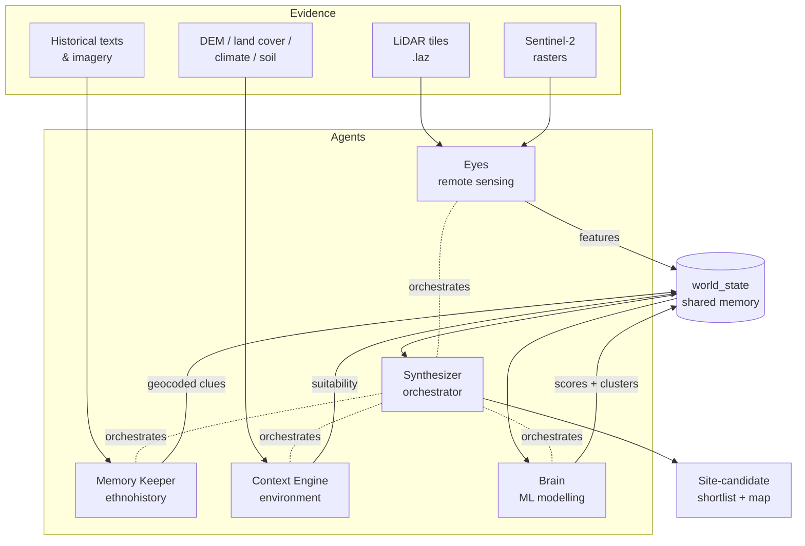

<div align="center">

# casiquiare

**A multi-agent AI system for archaeological discovery in the Amazon.**

Fusing LiDAR, satellite imagery, historical archives, and environmental data
to surface likely pre-Columbian settlement sites.

[](LICENSE)
[](requirements.txt)
[](#status)

</div>

---

> The **Casiquiare** is a natural canal that links the Orinoco and Amazon river
> systems — a rare hydrological bridge between two great basins. This project
> takes the same name: a bridge between disciplines that rarely share a
> pipeline — remote sensing, machine learning, ethnohistory, and
> paleoecology — pointed at a single question.

## The question

Much of the pre-Columbian Amazon was inhabited, engineered, and shaped by
people. Their traces — mounds, ring ditches, geoglyphs, raised fields, causeways —
survive under canopy and are increasingly visible to LiDAR and multispectral
sensors. The signal is faint, the search space is continental, and the ground
truth is scattered across colonial chronicles, indigenous oral tradition, and
ecological records.

**casiquiare** treats site prospection as a coordination problem. No single
model reads terrain, history, and ecology at once — so instead of one model, it
runs a small team of specialists that each read one kind of evidence and hand
their findings to the next.

## The team

Five specialist agents, coordinated by one orchestrator. Each owns a slice of
the evidence, exposes its capabilities as callable tools, and writes its
findings to a shared world state. Personas and skill stacks are defined in
[`AGENTS.md`](AGENTS.md).

| Agent | Persona | Reads | Produces |
|-------|---------|-------|----------|
| **Synthesizer** | Integrative archaeologist & orchestrator | Everything | Ranked site-candidate shortlists, research direction |
| **Eyes** | Remote-sensing & GIS lead | LiDAR, Sentinel-2 | Geometric anomalies → GeoJSON features |
| **Brain** | Data engineer & ML modeller | Feature tables | Site-likelihood scores, settlement clusters |
| **Memory Keeper** | Ethno-historian & knowledge curator | Historical texts, images | Geocoded clues, toponym concordances |
| **Context Engine** | Environmental & geo-archaeological analyst | DEM, land cover, climate | Environmental suitability summaries |

Every agent is a small dataclass wrapping a persona (system prompt), a tool
registry, and an OpenAI function-calling loop (`plan_and_act`). Agents can be
driven programmatically (call a tool directly) or autonomously (hand the LLM a
goal and let it choose tools). If the OpenAI SDK or a heavy geospatial
dependency is missing, the agent degrades gracefully rather than crashing —
tools that can run, run.

## How it fits together



A typical discovery loop:

1. **Eyes** turns raw LiDAR into a bare-earth DTM, derives hillshade and local
   relief models, and scans them (plus NDVI/NDWI from Sentinel-2) for geometric
   forms in the 50–300 m range typical of earthworks. Detections across sensors
   are merged and exported as GeoJSON.
2. **Memory Keeper** mines colonial chronicles and archives — OCR, translation
   (ES/PT → EN), named-entity extraction, geocoding, and *distance-clue*
   inference ("three days upriver from …") — to propose candidate coordinates,
   and runs semantic search over an indexed text + image corpus.
3. **Context Engine** scores each candidate's environmental plausibility from
   elevation, land cover, soil, distance-to-water, and climate.
4. **Brain** trains a classifier (RandomForest or XGBoost) on the combined
   features to estimate site likelihood, then clusters nearby detections
   (DBSCAN) into candidate settlements.
5. **Synthesizer** ties the threads together and produces a ranked shortlist —
   the readiness signal for a field expedition.

Intermediate results flow through [`world_state.py`](world_state.py), a simple
in-memory dictionary. Each agent action appends a structured `AgentMessage`
(`agent`, `type`, `content`, `timestamp`) to a shared log, so any agent — or the
web dashboard — can inspect what the others have found.

```python
from world_state import world_state
model_info = world_state.get("latest_model")
clusters   = world_state.get("clusters", {})
```

## Repository layout

```
casiquiare/
├── agents/
│   ├── synthesizer/     Orchestrator — plans and delegates across agents
│   ├── eyes/            Remote sensing: LiDAR/raster pipeline, shape detection, CLI
│   ├── brain/           ML: training, scoring, clustering, code execution
│   ├── memory/          Ethnohistory: OCR, NLP, geocoding, vector search
│   └── context/         Environment: DEM/land-cover/soil/climate sampling
├── detection/           Edges, contours, lines, shapes, cross-sensor merge, ML post-filter
├── processing/          Low-level geo: DTM, hillshade, LRM, NDVI/NDWI, tiles, image utils
├── io_utils/            Raster & LiDAR readers, data-path resolution
├── interface/
│   ├── backend/         Flask API (detections, tiles, logs) + app factory
│   └── frontend/        React + TypeScript + MUI + Leaflet dashboard
├── milvus_client.py     Milvus vector DB: text (1536-d) & CLIP image (512-d) collections
├── clip_model.py        CLIP image encoder
├── world_state.py       Shared in-memory state and structured message log
├── output.py            GeoJSON serialization of detections
├── log_config.py        Logging setup
├── agent.yaml           Tool manifest for external orchestrators
├── sample_config.yaml   Annotated runtime configuration
├── Dockerfile           Multi-stage build (React → Flask)
└── tests/               54 pytest modules
```

## Getting started

### Requirements

- Python 3.12
- An OpenAI API key (for the LLM-driven agent loops)
- Optional but recommended for the full geospatial toolkit: `scipy` and GDAL
  (the `osgeo` module) for hillshade/LRM generation
- Optional for semantic search: a running [Milvus](https://milvus.io) instance
- Node 18+ if you want to build the web dashboard

Every heavy dependency is imported defensively — the codebase runs (and tests
pass) even when optional libraries are absent; the features that need them
simply become unavailable.

### Install

```bash
git clone https://github.com/nevpit/casiquiare.git
cd casiquiare
pip install -r requirements.txt
export OPENAI_API_KEY="sk-..."
```

### Scan an area from the command line

The Eyes agent ships a CLI for the core detection pipeline:

```bash
python -m agents.eyes.cli scan path/to/tile.tif --save-geojson --save-snippets
```

This loads the raster, detects features, and writes
`<area>_features.geojson` (plus 256×256 PNG snippets around each detection for
quick visual inspection).

### Programmatic usage

Each agent tool can be imported and called directly.

```python
from agents.eyes import eyes_tools as eyes

# LiDAR → DTM → hillshade → feature detection, end to end
results = eyes.scan_lidar_area("tile.laz", min_size=50, max_size=300)

# Or step by step
dtm  = eyes.lidar_tile_dtm("tile.laz", out_dir="derived", return_paths=True)
shps = eyes.detect_shapes(dtm["hillshade"], dtm["profile"])
eyes.save_snippets(dtm["hillshade"], shps["features"], "snippets")

# Sentinel-2 vegetation anomalies
sat = eyes.analyze_satellite_image("sentinel.tif", ndvi_bands=(4, 8))
```

```python
from agents.brain import brain_tools

# Train a site-likelihood classifier (random_forest by default, or xgboost)
info = brain_tools.train_model(df, model_type="xgboost", n_estimators=200)
```

```python
from agents.context import ContextEngine

engine  = ContextEngine()
summary = engine.analyze_environment(
    dem="dem.tif", land_cover="lc.tif", soil="soil.tif",
    distance="water.tif", climate="clim.tif",
    context_layers={}, lat=-3.456, lon=-60.123,
)
```

### Orchestrated runs

Let the Synthesizer plan and execute across all agents via LLM function calling:

```python
from agents.synthesizer import Synthesizer

synth = Synthesizer()
answer = synth.plan_and_act(
    "Given the LiDAR detections in tile_01, cross-reference historical "
    "clues near the Rio Negro and rank the most promising site candidates."
)
```

## Semantic search (Milvus + CLIP)

The Memory Keeper can index and query a text + image corpus using a self-hosted
Milvus vector store. Connection parameters come from `MILVUS_HOST` /
`MILVUS_PORT` (defaulting to `localhost:19530`); the Flask backend connects and
provisions collections automatically at startup.

```python
from agents.memory import memory_tools

# Semantic text search over indexed documents
hits = memory_tools.search_text("Amazon basin settlements", top_k=3)

# CLIP-based image similarity — query by image or by text
imgs = memory_tools.search_images("ancient pottery", top_k=5)
```

Text embeddings are stored in a 1536-dimension collection; CLIP image
embeddings in a separate 512-dimension collection.

## Web dashboard

An experimental Flask + React viewer plots detections on an interactive map,
with side panels for run logs and summaries.

```bash
make dashboard
```

This installs requirements, builds the React frontend, and launches the Flask
server (which serves both the built app and generated map tiles). See
[`interface/README.md`](interface/README.md) for tile generation and manual
steps.

The backend exposes:

| Route | Purpose |
|-------|---------|
| `GET /eyes/detections` | Latest `*_features.geojson` as JSON |
| `GET /eyes/summary` | Latest run summary (plain text) |
| `GET /eyes/logs?n=…` | Tail of the run log |
| `GET /eyes/snippets/<file>` | Detection snippet PNGs |
| `GET /tiles/<layer>/<z>/<x>/<y>.png` | Pre-generated XYZ map tiles |

The map paginates GeoJSON in pages of 2,000 features to stay responsive on
large detection sets.

### Docker

```bash
docker build -t casiquiare .
docker run -p 5000:5000 -e OPENAI_API_KEY=sk-... casiquiare
```

The multi-stage image builds the React frontend, installs the Python backend
with GDAL, and serves everything on port 5000.

## Configuration

Runtime parameters — logging, model choice, detection thresholds, concurrency,
Milvus, and CLIP — are documented in [`sample_config.yaml`](sample_config.yaml).
Backend paths are read from environment variables (`EYES_OUTPUT_DIR`,
`EYES_TILE_DIR`, `MILVUS_HOST`, `MILVUS_PORT`, `OPENAI_API_KEY`).

The agent tool surface is also described declaratively in
[`agent.yaml`](agent.yaml) for use by external orchestrators.

## Testing

```bash
pytest
```

The suite (54 modules under `tests/`) covers the detection pipeline, ML tools,
context sampling, memory/vector-search helpers, backend routes, and agent
integration. Tests are written to run without the optional heavy dependencies.

## Status

casiquiare is **research software** — an exploration of how a coordinated group
of AI agents might accelerate archaeological prospection. Interfaces are
experimental and evolving. Detections are candidates for expert review, never
conclusions; any real-world fieldwork must respect indigenous data sovereignty
(FPIC/CARE), permitting, and site-protection obligations. Contributions and
ideas are welcome.

## License

[Apache License 2.0](LICENSE).
